# 🌐 Project: Developing AWS Architecture Using AWS CloudFormation


## 🚀 Objective

The objective of this project is to design, deploy, and document a highly available AWS infrastructure using AWS CloudFormation following Infrastructure as Code (IaC) principles rather than manual configuration each single resource through the AWS console. The stack was deployed and validated using both the AWS Management Console and the AWS CLI. The infrastructure consists of:

* a VPC
* 2 public and 2 private subnets across 2 Availability Zones
* an Internet Gateway
* a public and a private route table
* a security group allowing HTTP, HTTPS, and SSH traffic

## 🏗️ Architecture Diagram


## 📋 Prerequisites

You need the following for deploying this infrastructure:

* basic knowledge of AWS
* an AWS account
* AWS CLI (v2.34.38 or later) - [Installation Guide](https://docs.aws.amazon.com/cli/latest/userguide/getting-started-install.html)
* git for cloning the repository

## 📁 Repository Structure

```
aws-cloudformation/
├── screenshots               # Folder with screenshots
    ├── CLI                   # Folder with CLI screenshots
    └── Management-Console    # Folder with Management Console screenshots
├── Diagram.excalidraw        # Excalidraw file for the diagram
├── Diagram.png               # Diagram of the infrastructure
├── README.md                 # This file
└── template.yaml             # Infrastructure file
```

## 🔧 Deployment Steps

### 1. Configure AWS CLI

Configure AWS CLI using the command:
```bash
aws configure
```
Enter your credentials.

### 2. Clone the Repository
```bash
git clone https://github.com/HamsterHugo/aws-cloudformation.git
cd aws-cloudformation
```

### 3a. Deployment - AWS CLI

1. Create the stack:
```Bash
aws cloudformation create-stack --stack-name network-infrastructure-cli --template-body file://template.yaml
```

2. Check the status:
```Bash
aws cloudformation describe-stacks --stack-name network-infrastructure-cli
```
Repeat the command until `StackStatus` shows `CREATE_COMPLETE`.

### 3b. Deployment - AWS Management Console

1. Login to AWS
2. Check the region. It has to be `us-east-1`.
3. Enter `CloudFormation` into the search box and select it.
4. Click on the button `Create Stack`.
5. Choose `With new Resources (Standard)` .
6. In the section `Prerequisite - Prepare template` choose `Template is ready`.
7. In the section `Specify template` choose `Upload a template file` and select the file `template.yaml`.
8. Click on the button `Next`.
9. Enter `network-infrastructure` for the field `Stack name`.
10. Click on the button `Next`.
11. Keep the defaults for `Stack Options`.
12. Click on the button `Next`.
13. Check the summary and finally click on the button `Submit`.
14. Now AWS creates the stack. Click on the `Events` tab and wait until the status of each reasource changed from `CREATE_IN_PROGRESS` to `CREATE_CPMPLETE`.

### 4a. Validation - AWS CLI

1. To check the creation of the resources enter the following command:
```Bash
aws cloudformation describe-stack-resources --stack-name network-infrastructure-cli --no-cli-pager
```
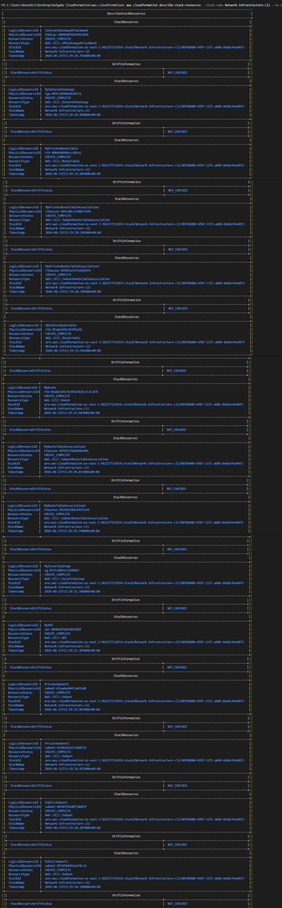

2. To check the output enter the following command:
```Bash
aws cloudformation describe-stacks --stack-name network-infrastructure-cli --query "Stacks[0].Outputs"
```
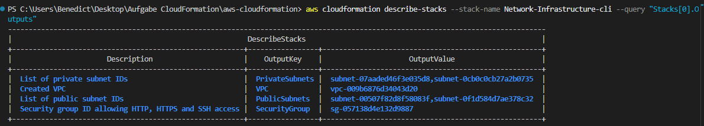
Take a note of the VPC id (`vpc-...`).

3. To check the creation of the subsnets enter the following command:
```
Bash
aws ec2 describe-subnets --filters "Name=vpc-id,Values=<your-vpc-id> -no-cli-pager"
```
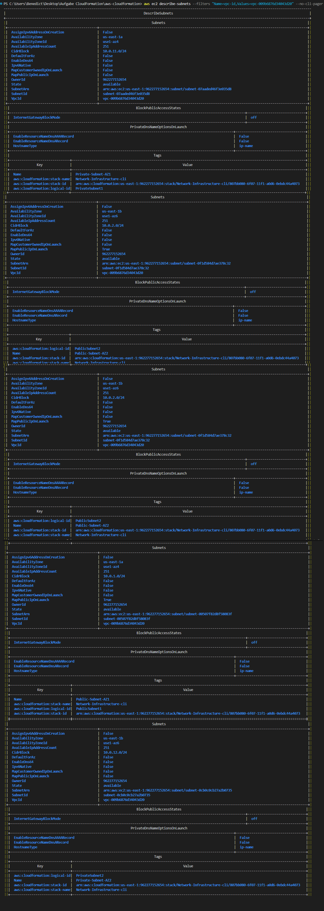

### 4b. Validation - AWS Management Console

1. View your stack and select the tab `Resources`:
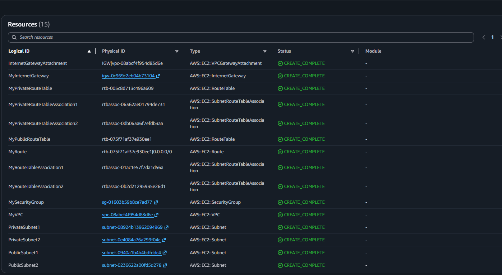

2. Select the tab `Outputs`:
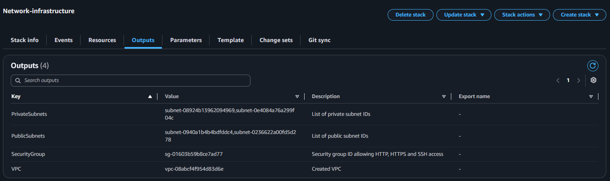

3. Enter `VPC` in the search box, select it and click on `Your VPCs`:
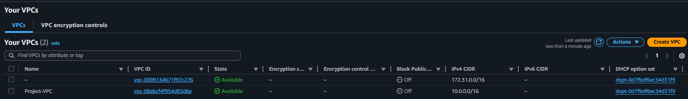

4. Click on `Subnets` in left navigation pane:
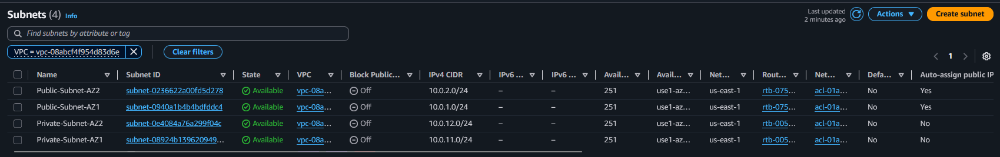

5. Click on `Route Tables` in the left navigation pane. In the section `Public RT` choose `Routes`:
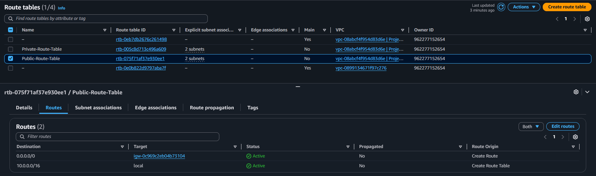

6. Select the tab `Subnet Associations`:
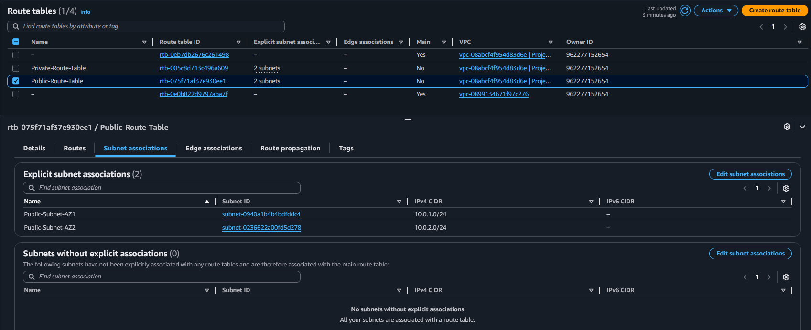

7. Click on `Internet Gateways` in the left navigation pane:
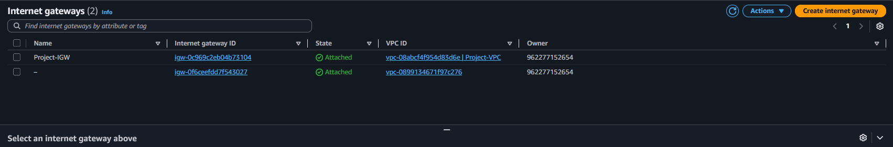

8. Click on `Security Groups` in the left navigation pane. Select the Security Group `Webserver-SG`. Choose the tab `Inbound Rules`:
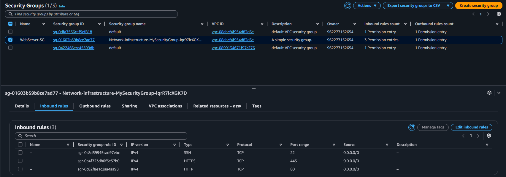

### 5a. Cleanup - CLI

1. To delete the whole stack enter the following command:
```Bash
aws cloudformation delete-stack --stack-name network-infrastructure-cli
```

2. Wait a while. To check the correct deletion enter the follwoing command:
```Bash
aws cloudformation describe-stacks --stack-name network-infrastructure-cli
```
If you get an error message the deletion was successful.
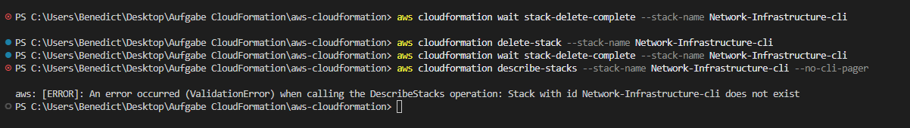

### 5b. Cleanup - AWS Management Console

1. Enter `Cloudformation` into the search box and select it which opens the CloudFormation console.
2. Select the stack and click on the button `Delete`.
3. In the conformation window click on `Delete`.
4. You can folllow the deletion process in the tab `Events`.
5. View the stack list. You should see the status `DELETE_COMPLETE`.
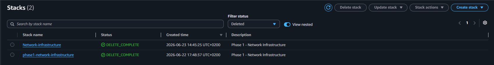