# 🌐 Project: Developing AWS Architecture Using AWS CloudFormation


## Project Overview

This learning project's aim is to design, deploy and document a Web application using AWS CloudFormation following Infrastructure as Code (IaC) principles rather than manually configuring each resource through the AWS console. The project consists of three phases. In phase 1 the network infrastructure will be set up. In phase 2 the network will be extended with an Amazon EC2 instance hosting a web server. In phase 3 an AWS Auto Scaling and an Application Load Balancer will be added to the infrastructure.

## 📁 Repository Structure

```
aws-cloudformation/
├── diagrams/                          # Architecture diagrams
├── screenshots/                       # Deployment and validation screenshots
│   ├── 01-network/                    # Phase 1 screenshots
│   │   ├── CLI/                       # CLI screenshots
│   │   └── Management-Console/        # Console screenshots
│   └── 02-webserver/                  # Phase 2 screenshots
│       └── CLI/                       # CLI screenshots only
├── templates/                         # CloudFormation templates
│   ├── network-security.yaml          # Phase 1: Network infrastructure
│   └── wordpress-server.yaml          # Phase 2: WordPress web server
├── .gitignore                         # Gitignore
└── README.md                          # Project documentation
```

## Phase 1: Network Infrastructure

### 🚀 Objective

The objective of phase 1 is to set up the AWS infrastructure using AWS CloudFormation. The first stack can be deployed and validated using both the AWS CLI and AWS Management Console. The infrastructure consists of:

* a VPC
* 2 public and 2 private subnets across 2 Availability Zones
* an Internet Gateway
* a public and a private route table
* a security group allowing HTTP and HTTPS traffic from anywhere, and SSH only from the user's public IP

### 🏗️ Architecture Diagram

The following diagram shows the network infrastructure deployed in Phase 1, including the VPC, public and private subnets across two Availability Zones, the Internet Gateway, and the route tables.

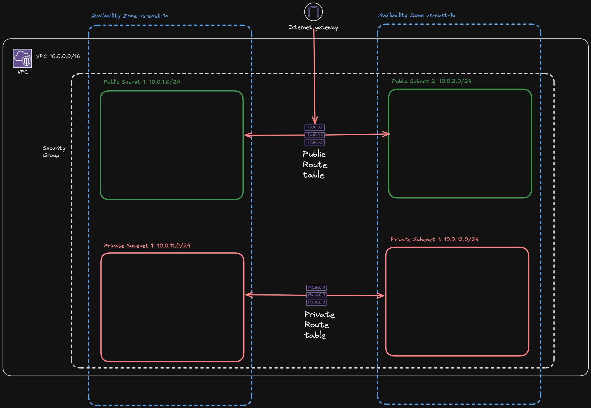

### 📋 Prerequisites

* Basic knowledge of AWS and CloudFormation
* An AWS account with sufficient permissions to create VPCs, subnets, and security groups
* AWS CLI (v2 or later) - [Installation Guide](https://docs.aws.amazon.com/cli/latest/userguide/getting-started-install.html)
* Git for cloning the repository
* Your current public IP address in CIDR notation (e.g. `203.0.113.42/32`) - check via [checkip.amazonaws.com](https://checkip.amazonaws.com)

### 🔧 Deployment Steps

#### 1. Configure AWS CLI

Configure AWS CLI using the command:
```bash
aws configure
```
Enter your credentials. For a readable output you can set the option `Default output format` to `table`.

#### 2. Clone the Repository
```bash
git clone https://github.com/HamsterHugo/aws-cloudformation.git
cd aws-cloudformation
```

#### 3a. Deployment - AWS CLI

1. Create the stack:
```Bash
aws cloudformation create-stack --stack-name network-infrastructure --template-body file://templates/network-security.yaml --parameters ParameterKey=MyIpAddress,ParameterValue=<YOUR-IP>/32 --no-cli-pager
```

Replace `<YOUR-IP>` with your public IP address.

2. Check the status:
```Bash
aws cloudformation describe-stacks --stack-name network-infrastructure --no-cli-pager
```
Repeat the command until `StackStatus` shows `CREATE_COMPLETE`.

Alternatively, you can use the `wait` command to automatically wait until the stack is complete. 

```Bash
aws cloudformation wait stack-create-complete --stack-name network-infrastructure
```

#### 3b. Deployment - AWS Management Console

1. Login to AWS
2. Check the region. It has to be `us-east-1`.
3. Enter `CloudFormation` into the search box and select it.
4. Click on the button `Create Stack`.
5. In the section `Prerequisite - Prepare template` choose `Choose an existing template`.
6. In the section `Specify template` choose `Upload a template`.
7. Click on the button `Choose file` and upload `network-security.yaml`.
8. Click on the button `Next`.
9. In the section `Provide a stack name` enter `network-infrastructure` in the field `Stack name`.
10. Enter your public IP address in CIDR notation (e.g. `<YOUR-IP-ADDRESS>/32`) in the field `MyIpAddress` under the section `Parameters`.
11. Click on the button `Next`.
12. Keep the defaults for `Stack Options` and click on the button `Next`.
13. Check the summary and finally click on the button `Submit`.
14. AWS starts creating the stack. In the tab `Events` you can follow the progress. Wait until the status shows `CREATE_COMPLETE`.

### ✅ Validation

#### AWS CLI

1. To check the creation of the resources enter the following command:
```Bash
aws cloudformation describe-stack-resources --stack-name network-infrastructure --query "StackResources[*].{Resource:LogicalResourceId,Status:ResourceStatus}" --no-cli-pager
```
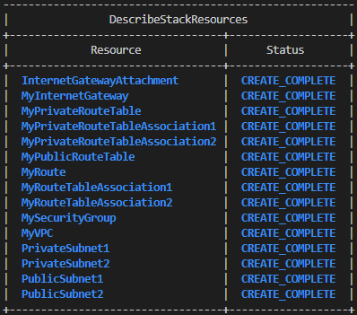

2. To check the output enter the following command:
```Bash
aws cloudformation describe-stacks --stack-name network-infrastructure --query "Stacks[0].Outputs" --no-cli-pager
```
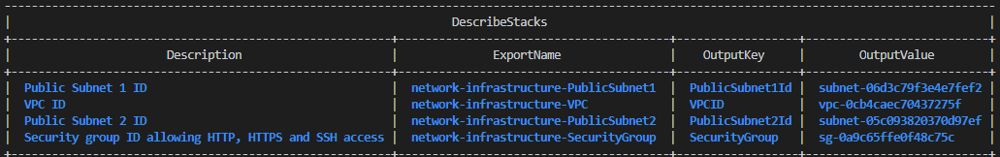
Note the VPC ID from the output (e.g. `vpc-0a1b2c3d`), you will need it for the next command.

3. To check the creation of the subnets enter the following command where you replace `<YOUR-VPC-ID>` with the vpc-id from above:
```Bash
aws ec2 describe-subnets --filters "Name=vpc-id,Values=<YOUR-VPC-ID>" --query "Subnets[*].{ID:SubnetId,CIDR:CidrBlock,AZ:AvailabilityZone,Public:MapPublicIpOnLaunch}" --no-cli-pager
```
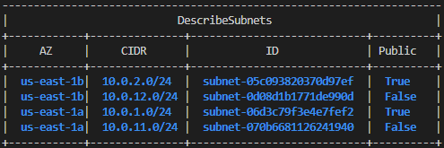

#### AWS Management Console

1. View your stack and select the tab `Resources`:
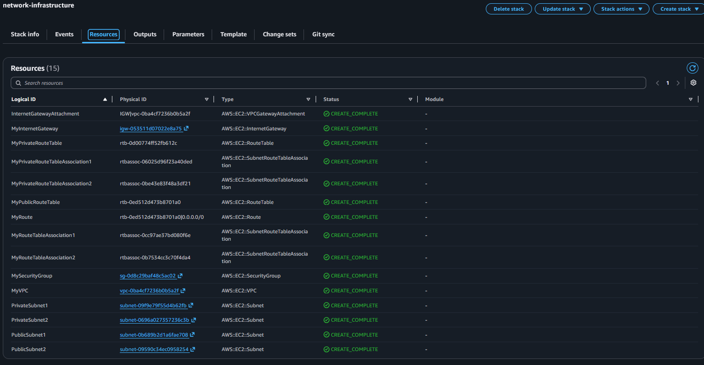

2. Select the tab `Outputs`:
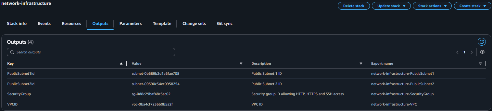

3. Enter `VPC` in the search box, select it and click on `Your VPCs`:
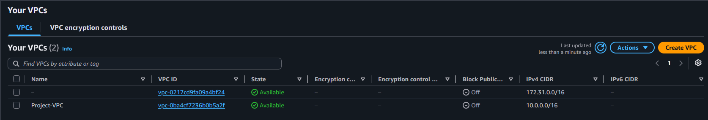

4. Click on `Subnets` in left navigation pane:
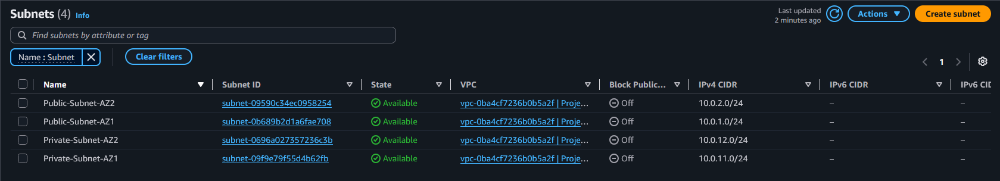

5. Click on `Route Tables` in the left navigation pane. In the section `Public RT` choose `Routes`:
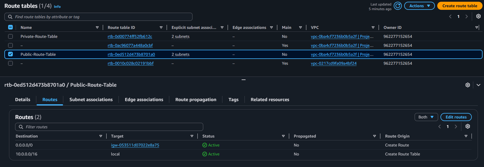

6. Select the tab `Subnet Associations`:
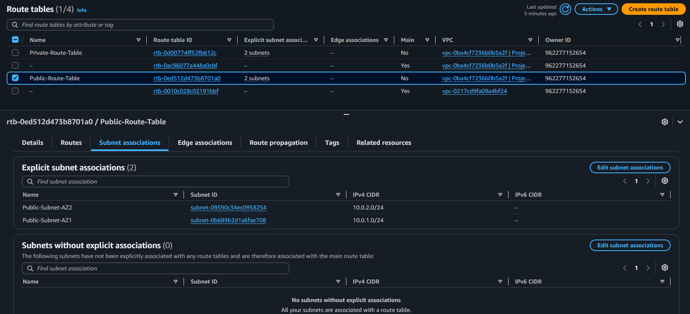

7. Click on `Internet Gateways` in the left navigation pane:
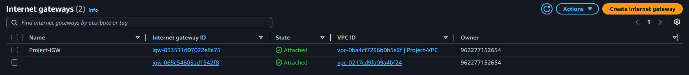

8. Click on `Security Groups` in the left navigation pane. Select the Security Group `Webserver-SG`. Choose the tab `Inbound Rules`:
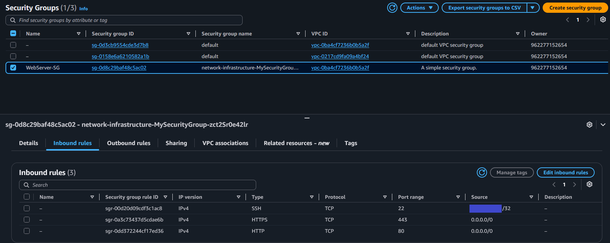

### 🧹 Cleanup

#### AWS CLI

1. To delete the whole stack enter the following command:
```Bash
aws cloudformation delete-stack --stack-name network-infrastructure
```

2. Wait a while. To check the correct deletion enter the following command:
```Bash
aws cloudformation describe-stacks --stack-name network-infrastructure --no-cli-pager
```
If you get an error message the deletion was successful.
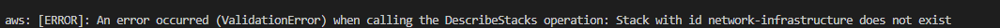

Alternatively, you can use the wait command:
```Bash
aws cloudformation wait stack-delete-complete --stack-name network-infrastructure
```

#### AWS Management Console

1. Enter `CloudFormation` into the search box and select it which opens the CloudFormation console.
2. Select the stack and click on the button `Delete`.
3. In the confirmation window click on `Delete`.
4. You can follow the deletion process in the tab `Events`.
5. View the stack list. You should see the status `DELETE_COMPLETE`.
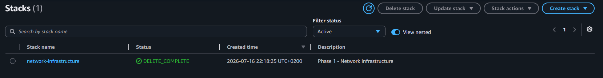

## Phase 2: Web Server Deployment and WordPress Installation

### 🚀 Objective

The objective of phase 2 is to extend the network infrastructure from phase 1 by deploying an Amazon EC2 instance hosting a WordPress web server. The entire installation is automated using CloudFormation UserData following Infrastructure as Code (IaC) principles. No manual configuration via SSH is required for the installation. The infrastructure consists of:

* an EC2 instance (t3.micro, Amazon Linux 2023) in the public subnet
* Apache web server, PHP and MariaDB client installed automatically via UserData
* WordPress downloaded and configured automatically via UserData
* SSH access restricted to the user's public IP via KeyPair authentication

### 🏗️ Architecture Diagram

The following diagram shows the infrastructure deployed in Phase 2, extending the network from Phase 1 with an EC2 instance hosting a WordPress web server in the public subnet.

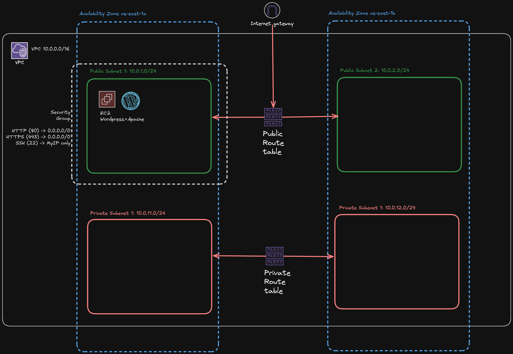

### 📋 Prerequisites

* Phase 1 stack (`network-infrastructure`) must be deployed and in status `CREATE_COMPLETE`
* An AWS account with sufficient permissions to create EC2 instances
* AWS CLI (v2 or later)
* Your current public IP address in CIDR notation (e.g. `203.0.113.42/32`) - check via [checkip.amazonaws.com](https://checkip.amazonaws.com)
* An EC2 KeyPair for SSH access (will be created in the deployment steps)

### 🔧 Deployment Steps

#### 1. Create KeyPair

```bash
aws ec2 create-key-pair --key-name wordpress-keypair --key-type ed25519 --query 'KeyMaterial' --output text | Out-File -FilePath wordpress-keypair.pem -Encoding ASCII
```

#### 2. Deploy Phase 2 Stack

```bash
aws cloudformation create-stack --stack-name wordpress-server --template-body file://templates/wordpress-server.yaml --parameters ParameterKey=KeyPairName,ParameterValue=wordpress-keypair --no-cli-pager
```

Wait until the stack is complete:
```bash
aws cloudformation wait stack-create-complete --stack-name wordpress-server
```

### ✅ Validation

TO check the details of the ec2 instance use the following command:
```bash
aws ec2 describe-instances --filters "Name=tag:Name,Values=EC2-1" --query "Reservations[*].Instances[*].{ID:InstanceId,State:State.Name,Type:InstanceType,IP:PublicIpAddress,AZ:Placement.AvailabilityZone,AMI:ImageId,KeyPair:KeyName}" --no-cli-pager
```

The output should look similiar to that:
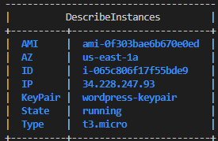

Take a note of the IP address in your output. Open your browser and enter the IP address in the URL. It should show you the wordpress page. If the browser shows you a connection error, just wait a few minutes.

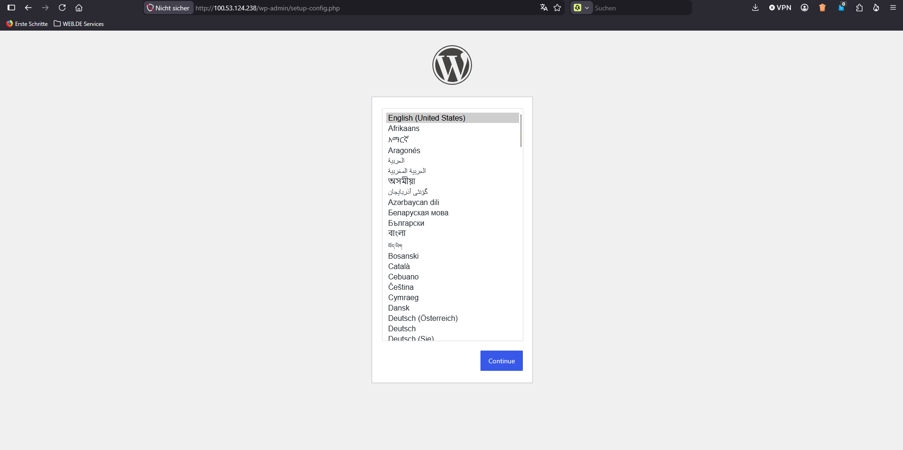

### 🧹 Cleanup